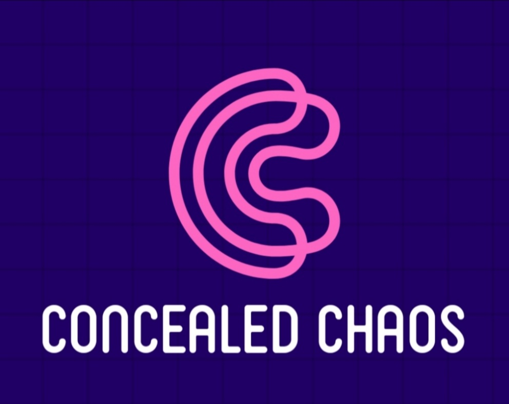

# Aimed for- Hack Nagpur
# Project- ConcealedChaos

## ConcealedChaos-"A depression Killing website"

### Introduction
Since 2013, millenials have seen a 47% increase in major- depression diagnoses. The overall rate increased from 3% to 4.4% among 18-34 years old. The reasons are not bounded nor they are instant, but it's observed that people between the age limit 18-34 are hit by failures in their lives(it may be career, Relationship , family problems etc.). They lack self motivation at the end and loose hopes from their life this gives a way to depression. Thus we through our website wish to give a guidance to handle all such circumstances by giving them motivation and presenting examples of others. Through our website people can share their failures and success stories in person or ananomously . This would build a strong community of motivated people who could combat all the life challenges and could reach the pinnacle.

Failure is not something to be ashamed off. We let you share your failures to the world and find relevant solutions.

### Features

-community/network builder

-user friendly interface

-user experience and responsive design

-Information/experience exchange 

-Tackles real life challenges like depression, stress.

-Powerful storytelling

### How  it can help the community
### Software Used
###Future Plans for Feature Enhancement
### Members

